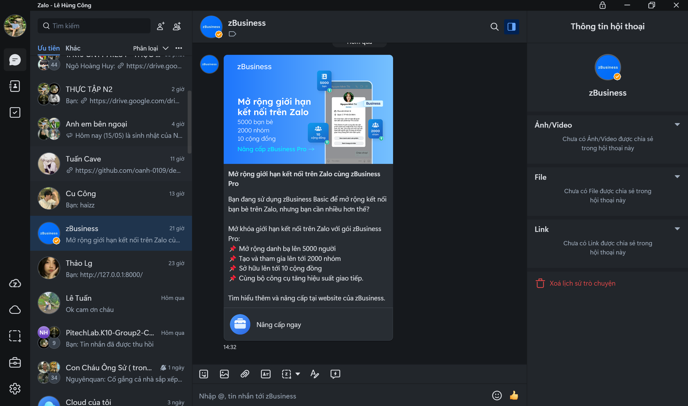

HEYCHAT là một ứng dụng nhắn tin thời gian thực hiện đại được phát triển bởi **Lê Hùng Công GROUP**. Ứng dụng cung cấp một nền tảng nhắn tin mượt mà, hỗ trợ chia sẻ tệp, tích hợp chatbot AI và giao diện thân thiện với người dùng.

---

## Tính năng

### Tính năng chính
- **Nhắn tin thời gian thực**: Gửi và nhận tin nhắn ngay lập tức.
- **Chia sẻ tệp**: Dễ dàng chia sẻ hình ảnh, video và các tệp khác.
- **Chatbot AI**: Tích hợp chatbot AI để trả lời tự động khi không có người dùng hoạt động.
- **Lưu trữ lịch sử tin nhắn**: Lưu trữ tin nhắn lâu dài để đồng bộ dễ dàng.
- **Giao diện thân thiện**: Thiết kế sạch sẽ và trực quan dành cho mọi thiết bị.

### Tính năng nâng cao
- **Chế độ tối**: Chuyển đổi giữa giao diện sáng và tối.
- **Thông báo đẩy**: Nhận thông báo ngay lập tức cho tin nhắn mới.
- **Mã hóa đầu cuối**: Bảo mật các cuộc trò chuyện với mã hóa mạnh mẽ.

---

## Hướng dẫn cài đặt " HEYCHAT "

### Yêu cầu
- **Backend**: Node.js, MongoDB
- **Frontend**: React Native CLI hoặc Expo
- **Công cụ bổ sung**: Docker (tùy chọn)

---

### Các bước để chạy ứng dụng

#### Backend
1. Clone repository:
   ```bash
   git clone https://github.com/LHC-GROUP/hey-chat.git
   cd hey-chat/backend
   ```
2. Cài đặt các thư viện:
   ```bash
   npm install
   ```
3. Đảm bảo MongoDB đang chạy cục bộ hoặc cung cấp URI kết nối.
4. Khởi động server:
   ```bash
   node server.js
   ```

#### Frontend
1. Điều hướng đến thư mục frontend:
   ```bash
   cd ../frontend
   ```
2. Cài đặt các thư viện:
   ```bash
   npm install
   ```
3. Chạy ứng dụng:
   ```bash
   npx react-native run-android # Android
   npx react-native run-ios # iOS
   ```

---

## Giao diện ứng dụng

### Màn hình đăng nhập


### Giao diện chat


### Chia sẻ tệp


---

## Liên hệ với chúng tôi

Để biết thêm thông tin hoặc hỗ trợ, vui lòng liên hệ:
- **Email**: [lehungcong1234@gmail.com](mailto:lehungcong1234@gmail.com)
- **Website**: [Truy cập Facebook](https://www.facebook.com/share/194zSfg21P/)

---

## Đóng góp

Chúng tôi hoan nghênh các đóng góp để cải thiện HEYCHAT:
1. Fork repository.
2. Tạo một nhánh tính năng mới:
   ```bash
   git checkout -b feature-name
   ```
3. Commit các thay đổi và đẩy lên:
   ```bash
   git commit -m "Thêm tính năng"
   git push origin feature-name
   ```
4. Tạo pull request với chi tiết về thay đổi của bạn.

---

## Giấy phép

Dự án này được cấp phép theo [MIT License](LICENSE).
